<div align="center">

# 🌌 GEN-Z AI Assistant  
### Your Smart AI Companion 🤖✨

Chat • Voice • Scan • Translate • Smart Settings  

</div>

---

## 🚀 About the App
**GEN-Z AI Assistant** is a modern AI-powered mobile application designed to make your daily tasks smarter, faster, and easier.

---

## ✨ Key Features
- 💬 AI Chat Assistant  
- 🎙️ Smart Voice Assistant  
- 📷 AI Scanner  
- 🌍 Language Translator  
- ⭐ Feedback & Rating System  
- ⚙️ Advanced Settings & Personalization  

---

## 📸 App Screenshots

### 🔐 Onboarding & Authentication
<p align="center">
  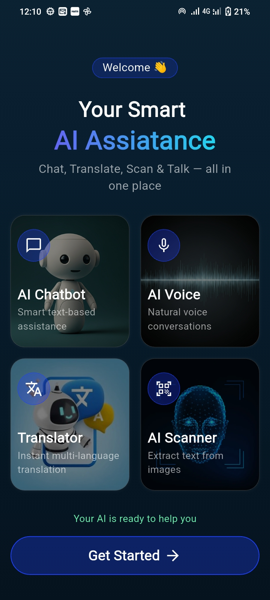
  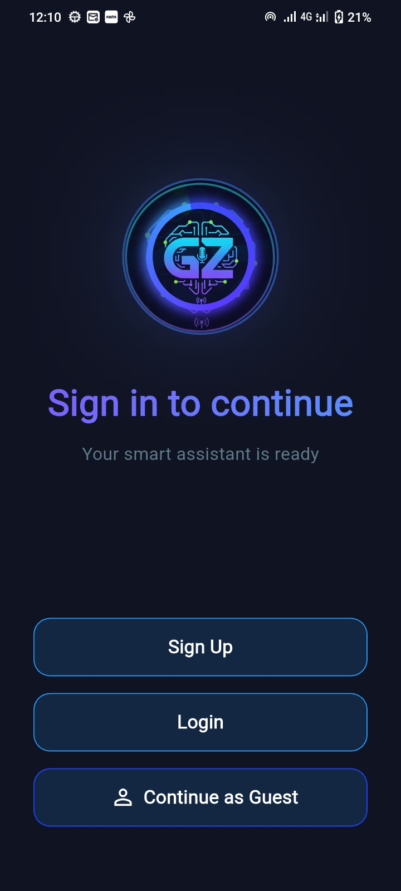
  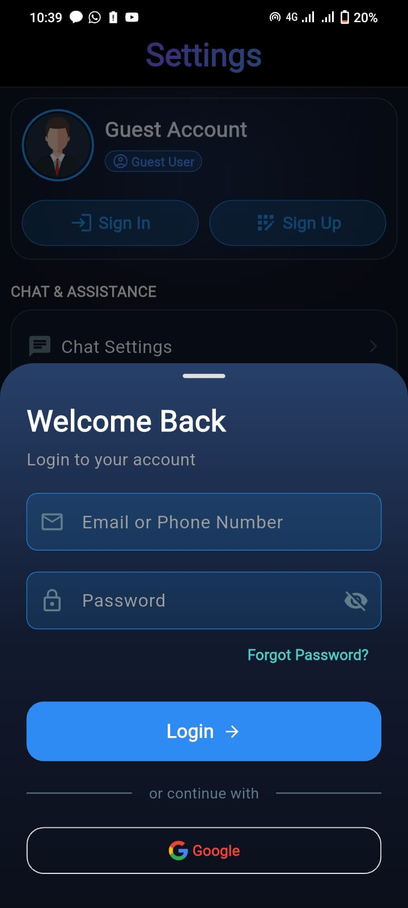
  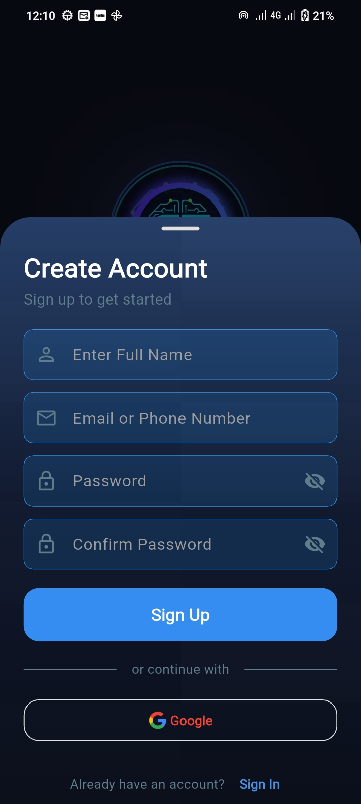
</p>

---

### 🏠 Home & Dashboard
<p align="center">
  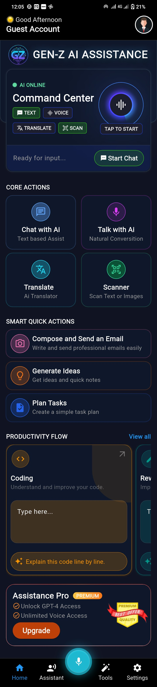
  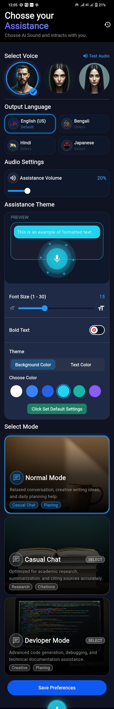
  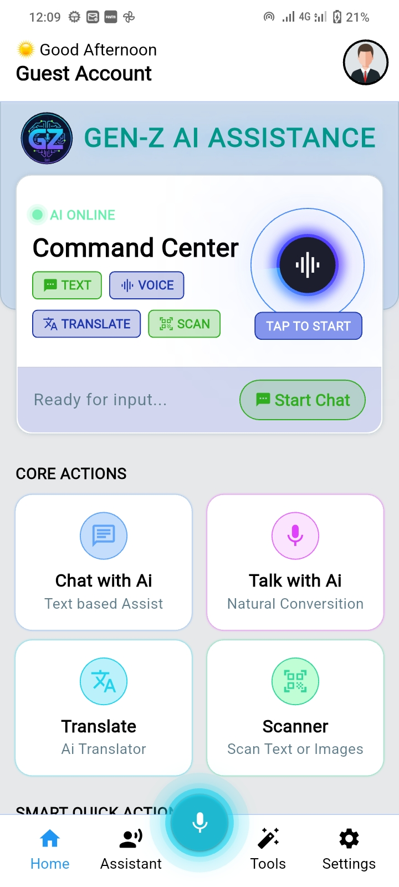
</p>

---

### 💬 AI Chat Experience
<p align="center">
  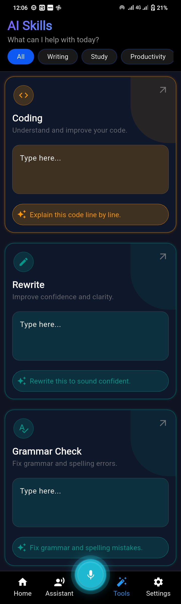
  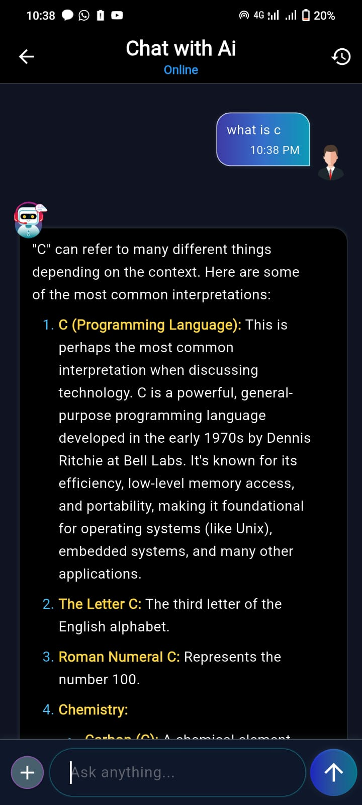
  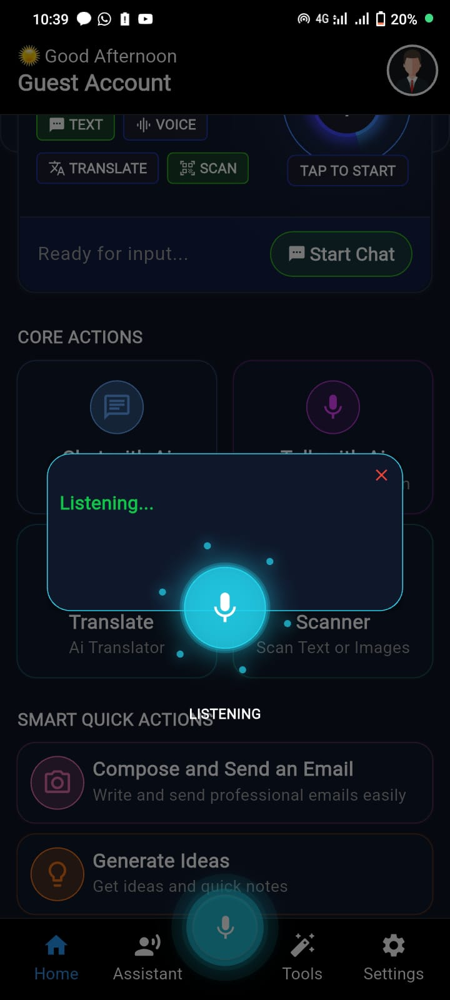
</p>

---

### 📷 AI Scanner & 🌍 Translator
<p align="center">
  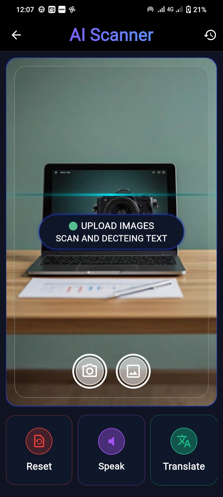
  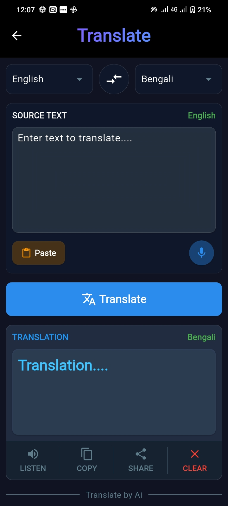
</p>

---

### ⚙️ Settings & Customization
<p align="center">
  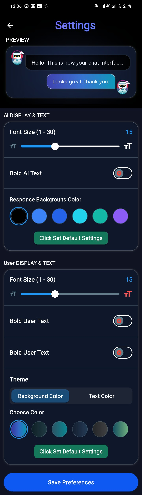
  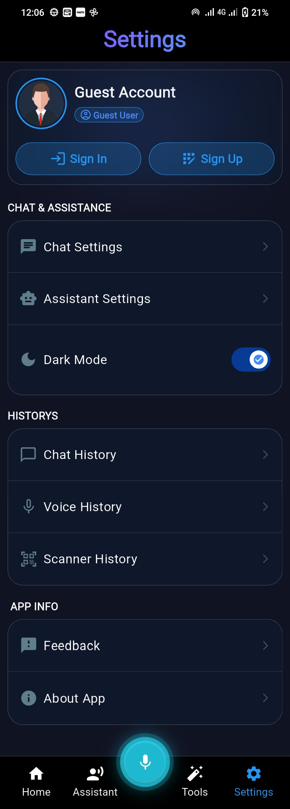
  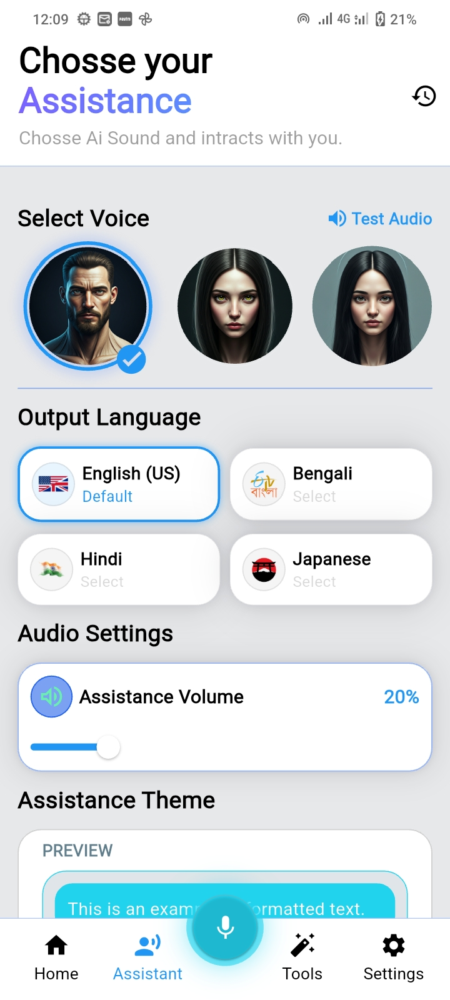
</p>

---

### ⭐ Feedback, History & About
<p align="center">
  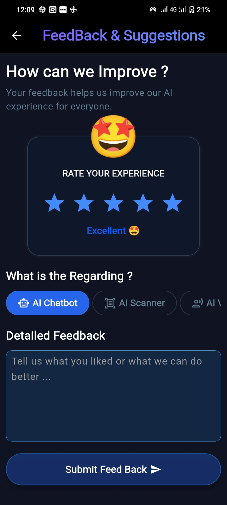
  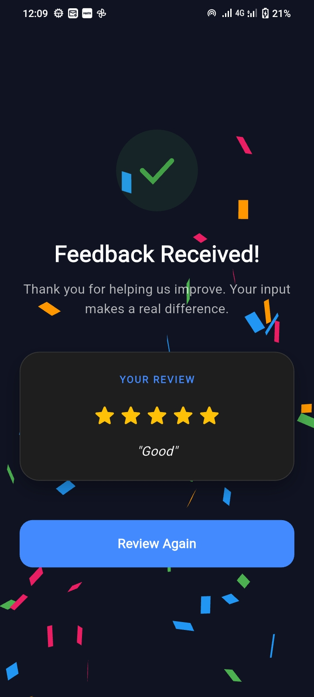
  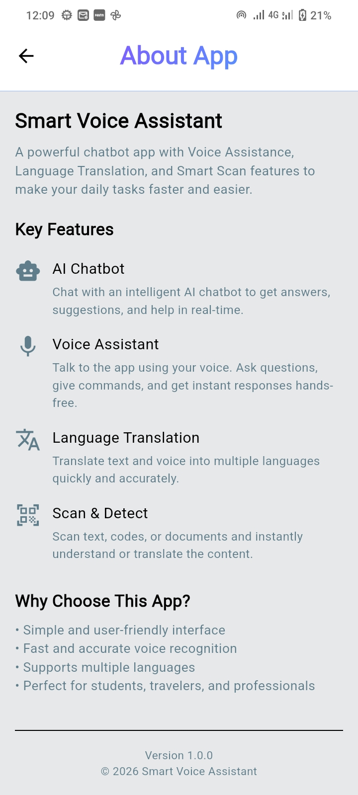
  
</p>

---

## 🛠 Tech Stack
- 📱 Flutter / Android  
- 🤖 AI APIs  
- 🔐 Firebase / Backend Services  

---

## 📦 Installation
```bash
git clone https://github.com/your-username/your-repo-name.git
cd your-repo-name
